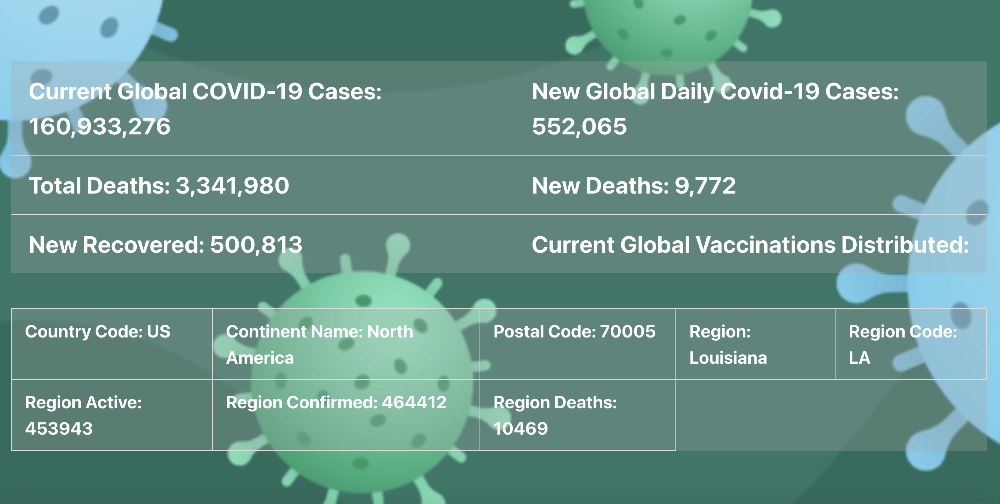
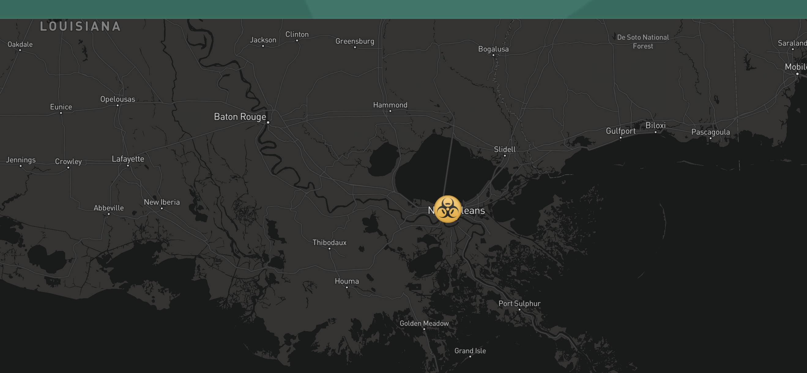

# Covid-19 Risk and Vaccine Assessment GeoLocation Application

## Description

- This is a Covid-19 Risk and Vaccine Assessment application that retrieves real-time Covid-19 cases and Covid-19 vaccine data based on the users geo-location. There is also formatting for manual entry of location if the user wishes to disable geo-location. 

- In preperation for future full-stack web development group projects, this application includes HTML, CSS, JS and Web-APIs to allow full functionality. 

- Upon load, the jumbotron displays the current date and time (utilizing Moment.js), Global Covid-19: Overall Cases, New Confirmed Cases, Vaccine Distribution, New Deaths, New Recovered, Total Confirmed Deaths, and a prompt to confirm/deny the geo-location feature. 

- All of this data is displayed within the HTML or in the browser by creating functions that fetch the APIs needed for the data. The data was then console logged to retrieve the data-set arrays. Enables application of a specific array to an HTML id that would then grab, and display the real-time data from the API. 

- If the user opts for enabling the geo-location, the browser will then display real-time Covid-19 data within the map radius. This is done by utilizing the geo-location API (listed under resources) and creating functions and variables that loop through each set of JSON data retrieved from the API. 

- If the user opts out of the geo-location feature, a form was created to allow input of Country, State/Region, City/Zipcode in the form of drop-down boxes. A new drop-down box is generated each time the user clicks the "search" button. addEvenetListeners were utilized to create button functionality.

- The application is ideal for travelers interested in seeking information on areas with the highest amount of infection rate confirmed so that they may avoid them, or prepare with proper PPI. 

- The application includes a geo-location vaccine feature that allows the user to retrieve real-time data on the amount of vaccines distributed in an area; whether that be based on their own geo-location or one that has been manually input.

- Our group was tasked with building a web application from scratch that executes a design; solving a real-world problem by integrating data recieived from multiple server-side API requests. 

- The idea was conceived and then created by the 5 group concensus. The project put each group member in a real-world coding situation and allowed them to adapt and hone their strengths and capabilities to meet the needs of the team and the project. This enabled the group to create a functional Covid-19 application with geo-location capabilities. 

- Because we were tasked with working collaboratively, we learned agile development methodologies and implement feature and bug fixes using git branch workflow and pull requests. The kanban board created in GitHub allowed us to move through each task seamlessly; alerting group members to tasks already being worked on. 

- This unit was focused mainly on:
  * Server-Side APIs
  * Git Branching Workflow
  * Agile Software Development

- Deployed Website - "https://mxdragon.github.io/Covid19Risk-VaccineAssessment/"

## Credits

- Collaborators:
  * [Bryan Bentz](https://github.com/MXDragon) 
  * [Diana Daghlas](https://github.com/ddaghlas)
  * [Drew Selden](https://github.com/selden-CBC2021)
  * [Audumn Vernon](https://github.com/audumnv)
  * [Cody Schenk](https://github.com/Codyschenk)
- Resources:
  * 📖 [API Resources](https://coding-boot-camp.github.io/full-stack/apis/api-resources)
  * [Global Covid-19 API](https://documenter.getpostman.com/view/10808728/SzS8rjbc#27454960-ea1c-4b91-a0b6-0468bb4e6712)
  * [Covid-19 Data API](https://covid19api.com/)
  * [Covid-19 Vaccines Distributed per Country/Region/City API](https://covid-api.mmediagroup.fr/v1/vaccines?country=)
  * [Covid-19 Regional Data API](https://github.com/M-Media-Group/Covid-19-API)
  * [Geo-Location API](https://ipdata.co/)

